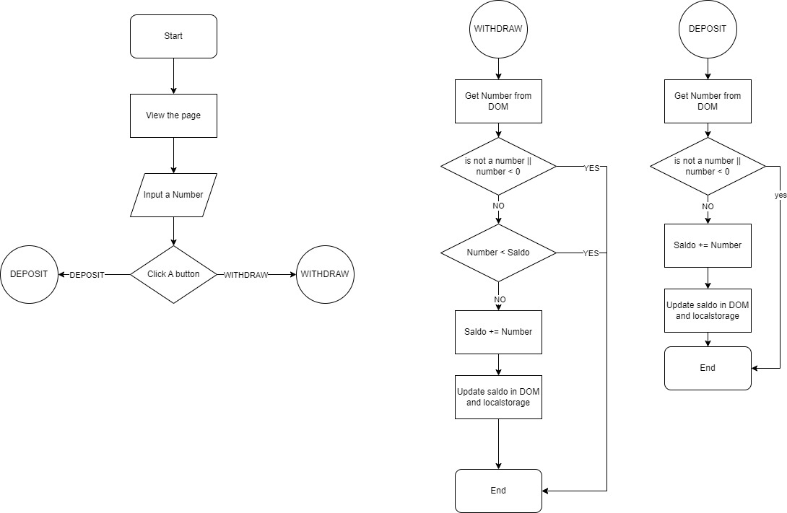

# Bank Account System

**IMPORTANT NOTES**: To me flowchart doesn't make sense to account user input. To me the a flowchart process start after using clicks something. To accomodate it, I created additional flowchart in main to explain how a user might use it.

This system represents a basic simulation of a bank account using Object Oriented Principles in JavaScript.

## Overview:

### Features:

1. **Encapsulation**:

   - The `BaseAccount` class encapsulates the `saldo` field by making it a private class field (`#saldo`).

1. **Inheritance**:

   - The `BankAccount` class extends the `BaseAccount` class showcasing the concept of inheritance.

1. **Overriding**:

   - The `BaseAccount` class provides a method `updateSaldo` which can be overridden by its subclasses to demonstrate overriding.

1. **Asynchronous Functions**:
   - Several methods, such as `init`, `reqWithdraw`, and `reqDeposit`, use async functions for simulating server responses.

### Classes:

1. **BaseAccount**:

   - Connects to a server to initialize and update the saldo.
   - Displays the type of account.

1. **BankAccount**:

   - Inherits features from `BaseAccount`.
   - Can deposit and withdraw amounts.
   - Handles UI elements such as buttons, inputs, and display for saldo.

1. **Server**:
   - Simulates server actions such as getting saldo, depositing, and withdrawing.
   - Uses `localStorage` to store the current saldo.

### Usage:

1. Create a new `Server` instance.
1. Create a new `BankAccount` instance, passing the `Server` instance to it.
1. Initialize the bank account using the `init` method.

### Example:

```javascript
const server = new Server();
const bankAccount = new BankAccount(server);
bankAccount.init();
```

**Note**: This is a simple simulation and doesn't provide real banking functionalities. Always consider security and best practices when dealing with real-world financial applications.

## Algorithm

### Flowchart



### Pseudocode

Pseudocode:

```pseudocode
Function reqDeposit:
    Begin
        - Disable input and buttons, show a loading state
        - Get the amount input by the user
        - Try to:
            1. Send a deposit request to the server with the given amount
            2. Wait for the server to process the deposit
            3. Update the displayed balance with the new balance
            4. Enable input and buttons, hide the loading state
        - If an error occurs, display the error message to the user
    End

Function reqWithdraw:
    Begin
        - Disable input and buttons, show a loading state
        - Get the amount input by the user
        - Try to:
            1. Send a withdrawal request to the server with the given amount
            2. Wait for the server to process the withdrawal
                a. Ensure the user has enough balance
            3. Update the displayed balance with the new balance
            4. Enable input and buttons, hide the loading state
        - If an error occurs, display the error message to the user
    End


Function getSaldo :
    Begin
        - Request the balance from the server
        - Update `saldo` with the new balance
    End
```

## Challenge Information

### Skill Metrics

1. Programming Algorithm
1. Melakukan error handling
1. Menerapkan Asynchronous process
1. Menerapkan OOP
1. Menggunakan Git

### Delivery

- [x] Membuat repositori baru di GitHub dengan nama "Basic-Banking-System"
- [x] Salin file bank_account.js Challenge 1 ke direktori proyek di repositori baru
- [x] Membuat file JavaScript baru dengan nama banking_system.js
- [x] Implementasikan kelas BankAccount dengan metode deposit() dan withdraw()
- [x] Gunakan setTimeout() untuk mensimulasikan operasi transaksi yang asynchronous
- [x] Commit dan push perubahan ke repositori GitHub

### Criteria

1. Menggunakan modular class OOP (40 points)
1. Mengurai proses berpikir dengan menggunakan flowchart (30 points)
1. Menggunakan GitHub untuk mengelola repository (30 points)
